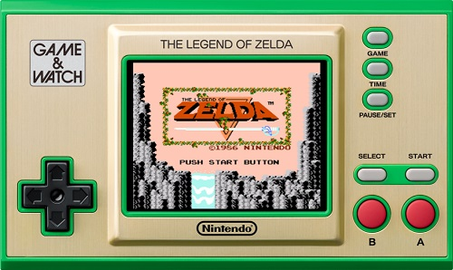

# Nintendo Game & Watch Wiki
> An awesome project.

  
Information on this wiki is mostly copied from [r/GameAndWatchMods](https://www.reddit.com/r/GameAndWatchMods/wiki/index/#wiki_welcome_to_our_game_.26amp.3B_watch_wiki.21).  
I just wanted to translate the information into a more convenient format.  

+ [Homebrew](homebrew/homebrew.md)
+ [Detailed Hardware Information](hardware/hardware.md)
+ [Upgrading the Game & Watch Storage](docs/upgrading/upgrading.md)
+ [Patches](docs/patches/patches.md)
+ [ROM Compatibility](docs/roms/compatibility.md)
+ [FAQ](docs/faq/faq.md)
+ [Controls/Button Macros](docs/faq/gwcontrols.md)
+ [Troubleshooting](docs/faq/troubleshooting.md)
+ [GitHub Repos](docs/faq/githubrepos.md)
+ [Game & Watch Aftermarket Supplies](docs/faq/supplies.md)
+ [Play LCD Games Online Here](docs/faq/play.md)